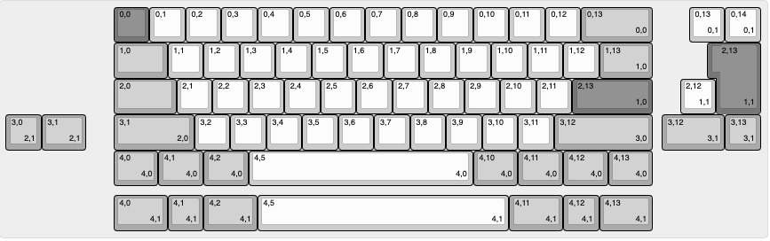

# shared
shared files for public access

---

## keyboard projects
### merro60
Two files are needed to configure the merro60 PCB.
- The \*.hex file is required for QMK flashing with VIA enabled
- The \*.json file is required for VIA operation

#### QMK guide
The QMK hex file will enable all possible keys on the merro60 PCB.
1. Download [chlx_merro60_via.hex](https://github.com/gaclee3b/shared/blob/main/merro60/chlx_merro60_via.hex)
2. Start up QMK Toolbox
3. Load in chlx_merro60_via.hex
4. Press reset button on PCB or short out reset contacts near spacebar socket
5. Flash it
6. Disconnect the PCB
7. Reconnect the PCB

Use VIA to do the actual configuration.

#### VIA guide
Layout options available are -
- split backspace
- ANSI / ISO enter
- split left shift
- split right shift
- ANSI / tsangan bottom row

To set up VIA to recognize the merro60 PCB -
1. Download [merro60_via-layout.json](https://github.com/gaclee3b/shared/blob/main/merro60/merro60_via-layout.json)
2. Start up VIA (merro60 should not be recognized yet, but we can keep going)
3. Go to 'Settings' tab
4. Enable 'Show Design tab'
5. Go to 'Design' tab
6. Load the \*.json file
7. Now use VIA as normal

Until I figure out how to push this json file into VIA's database, this is the only known way to program the merr60 PCB.

