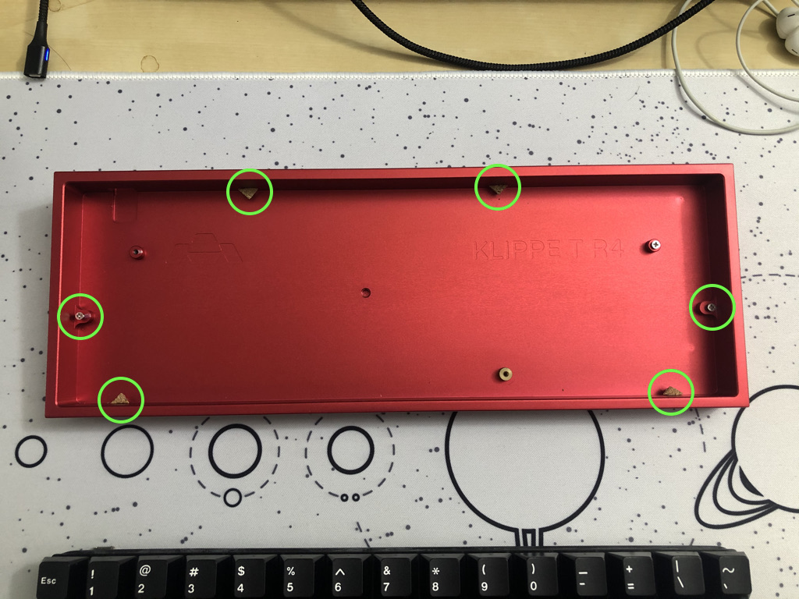
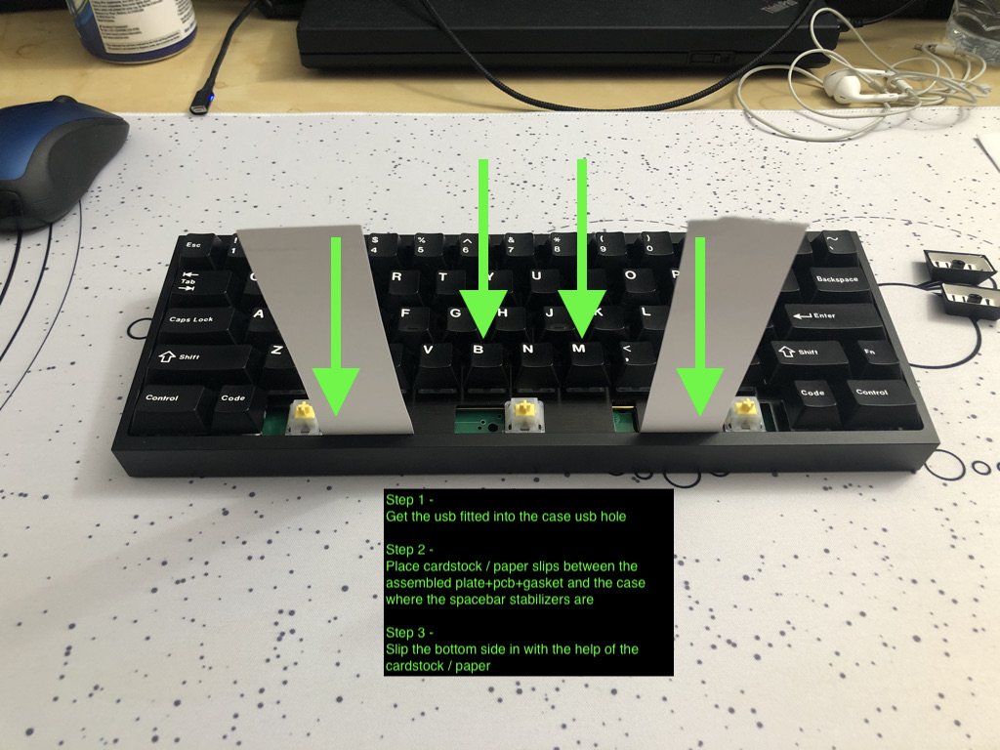
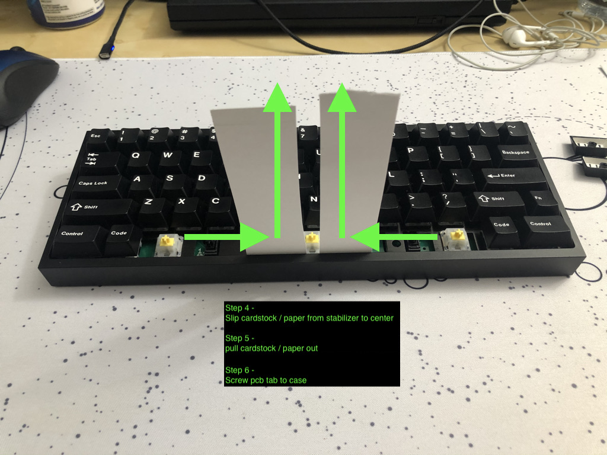
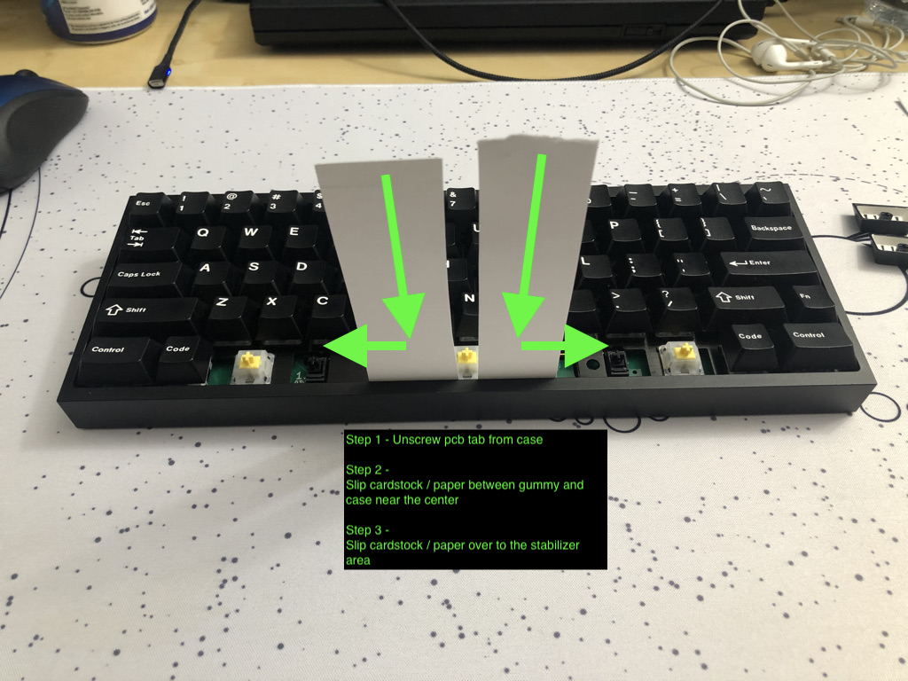
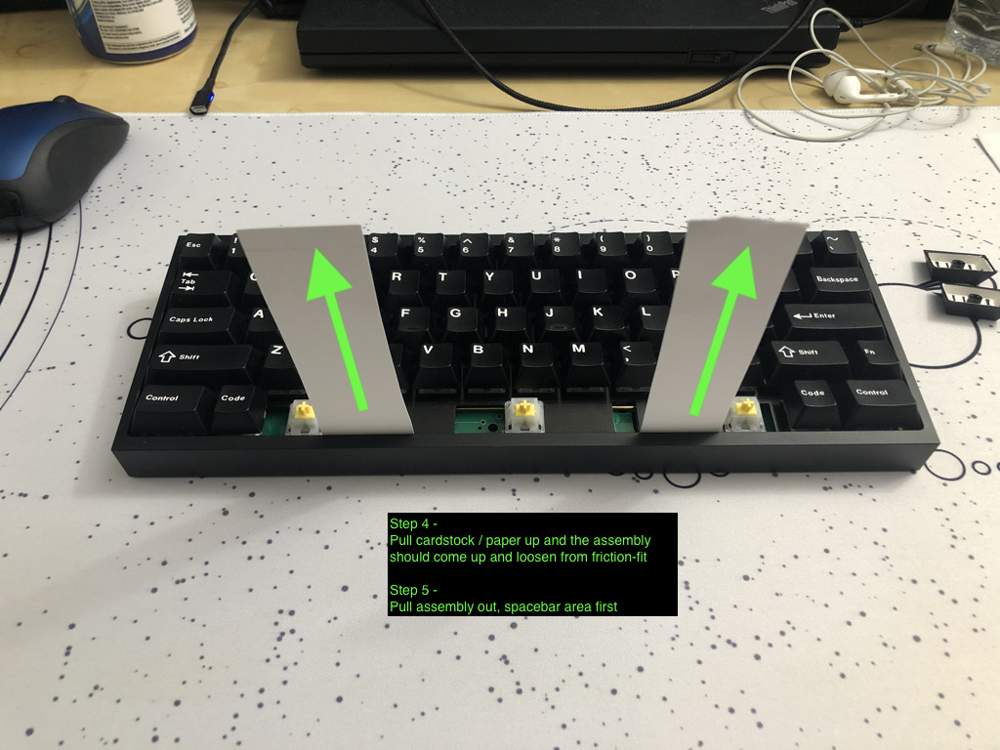
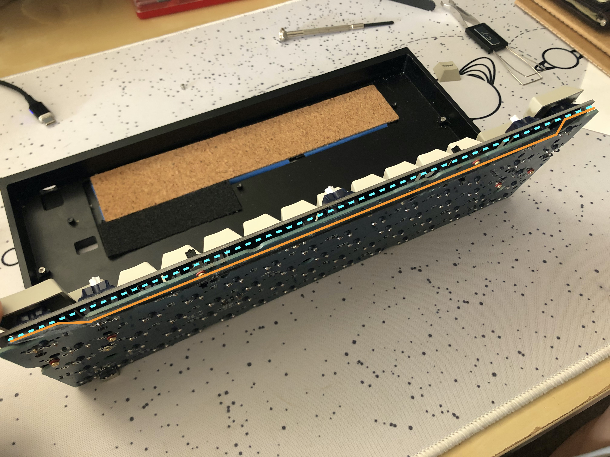

# shared
shared files for public access

---

## keyboard projects
### merro60
This guide includes three main sections -
1. QMK guide (for flashing VIA-enabled QMK)
2. VIA guide (for enabling VIA recognition)
3. physical installation guide

Two files are needed to configure the merro60 PCB.
- The \*.hex file is required for QMK flashing with VIA enabled
- The \*.json file is required for VIA operation

---

#### QMK guide
The QMK hex file will enable all possible keys on the merro60 PCB.
1. Download [chlx_merro60_via.hex](merro60/chlx_merro60_via.hex)
2. Start up QMK Toolbox
3. Load in chlx_merro60_via.hex
4. Press reset button on PCB or short out reset contacts near spacebar socket
5. Flash it
6. Disconnect the PCB
7. Reconnect the PCB

Use VIA to do the actual configuration.

---

#### VIA guide
Layout options available are -
- split backspace
- ANSI / ISO enter
- split left shift
- split right shift
- 6.25u / 7u / 10u bottom row

To set up VIA to recognize the merro60 PCB -
1. Download [merro60_via-layout.json](merro60/merro60_via-layout.json)
2. Start up VIA (merro60 should not be recognized yet, but we can keep going)
3. Go to 'Settings' tab
4. Enable 'Show Design tab'
5. Go to 'Design' tab
6. Load the \*.json file
7. Now use VIA as normal

Until I figure out how to push this json file into VIA's database, this is the only known way to program the merr60 PCB.

---

#### physical installation guide
This is just a guide for what I found easiest to install -
1. Use flat-top m2 screws
2. Leave the left and right screws in the case (green circles)
    - This is to give the PCB the expected height / distance from the case bottom
    - You can leave the screws in the other posts too except the one under the spacebar
    
    - If using a Mekanisk Fjell / Klippe T case, all contact points circled in green need 1.5-2mm of increased height to prevent bottom-out (I used small cutouts of cork cabinet liner)
    
3. (Optional) Add a small piece of foam in the bottom left corner of the case
    - I experienced some tilting where the bottom left would dip and the top right would rise
    - Putting a small piece of foam here seems to prevent too much tilt and doesn't affect acoustics / feel
    - Update - When using a full plate (non-HHKB), the friction fit is tight enough to prevent tilting
4. Assemble stabilizers + switches + plate + PCB
    - Must use clip-in stabilizers for the spacebar
    - Unknown if clip-in stabilizers are also needed for full backspace
5. Run gasket between plate and PCB around the whole assembly
    - If screw-in spacebar stabilizers are desired, refer to "optional oring configuration" section below
7. Line up USB port to case opening first
8. Slip in pcb/plate/gasket assembly using the paper tabs method (credit: believe0101)
    
    
8. Screw in the spacebar post / PCB tab to ensure PCB can't fall out
    - Bare screw is ok to use without a washer
    - Area has been reinforced with disconnected / floating metal
    

To pop the pcb/plate/gasket assembly out, reverse the paper tabs method (credit: believe0101)
    
    

#### optional oring configuration (allows screw-in stabilizers for tofu)
1. When running gasket between plate and PCB, run the gasket under the pcb through the cuts on the bottom pcb edge
    
3. Continue assembly same as above except the paper tabs would go where the gasket changes layer

---

#### credits
- ai03 - reference footprints, PCB design guide, voyager series PCB references
- evyd13 - plain60 / plain60flex PCB references
- hugokeys, singakbd - mount style inspiration
- coolmanguy, spookyghost, believe0101 - prototype testers
